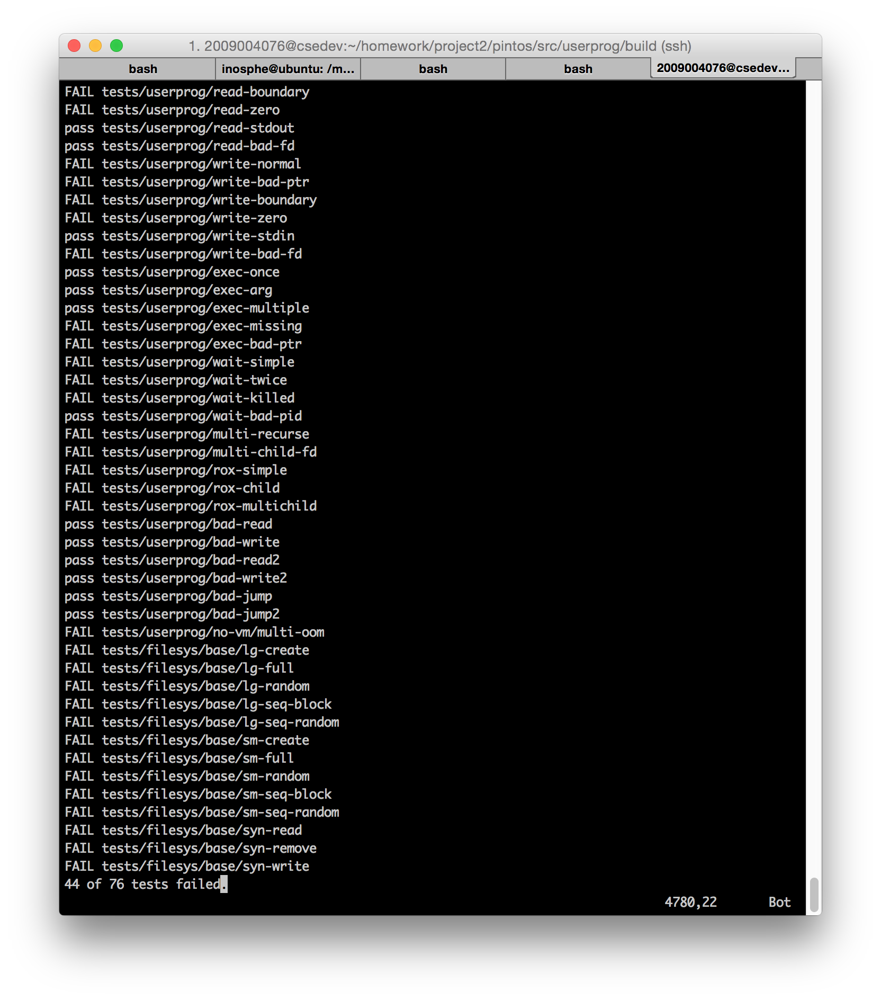

## 시스템 콜 구현

### 1. 개요

* 시스템 콜을 관리해주는 시스템 콜 핸들러와 일부 시스템 콜(halt, exit, create, remove)을 구현하여, 응용 프로그램에서 시스템 콜을 호출할 수 있도록 한다.

### 2. 목표
* esp를 통해 유저스택을 읽어 시스템 콜 넘버를 받아오고, 해당 넘버에 알맞는 시스템 콜을 호출하도록 한다.
* 특정 주소값이 유저 스택에 위치하고 있지 않다면 프로세스를 강제 종료하는 `check_address()` 함수를 구현한다.
* esp를 통해 유저스택을 읽어 스택 내부 값들의 주소를 배열에 저장한다.

### 3. 과제 해결을 위한 Pintos 분석
* 유저 스택의 top에는 호출할 시스템 콜의 번호가 저장되며, 그 아래로 차례대로 해당 시스템 콜의 인자들이 저장된다. 편의상 top/아래로 표현했지만 실제로는 스택이 깊을 수록 높은 주소에 위치한다.
* esp의 조작이 필요한데, 인터럽트의 esp 변수는 void* 타입이다. C 표준에서는 원칙적으로 void 포인터 타입의 산술 연산이 금지(illegal)되어 있다. 하지만 Pintos 컴파일시 사용되는 GCC 확장에서는 그러한 연산이 허용되며, Pintos 코드 내에서도 이미 void 포인터의 산술 연산이 캐스팅 없이 사용되고 있음을 확인했으므로 여기서도 그냥 캐스팅을 하지 않고 void 포인터를 직접 조작하기로 했다.
* 시스템 콜 번호는 lib/syscall_nr.h에 enum으로 정의되어 있다.

### 4. 해결과정

#### 시스템 콜 인자 저장
* 유저 스택에 저장된 시스템 콜 인자들을 커널로 불러와야 하는데 이를 그대로 복사하여 값을 저장할 것인지, 유저 스택의 해당 주소값만을 저장할 것인지에 대한 고민이 있었다. 하지만 커널에서 직접 유저 스택의 값을 참조하면 문제가 생길 수 있으므로, 안정성을 위해 약간의 오버헤드를 감수하고 값을 그대로 복사하였다.

## 프로세스 계층 구조
### 1. 개요
* 부모/자식 프로세스의 계층 구조를 구현하고, 세마포어를 통해 부모 프로세스가 자식 프로세스의 로드 및 종료 작업에서 대기할 수 있도록 한다.

### 2. 목표
* 스레드(프로세스) 디스크립터에 프로세스 계층 관계 표현을 위한 필드들을 추가한다. 
* 자식 프로세스를 만들고 프로그램을 실행시킨 뒤, 세마포어를 이용해 공유 영역으로의 접근을 잠시 블락하는 exec() 시스템 콜을 구현하여 자식 프로세스에서 프로그램의 메모리 적재를 완료할 수 있도록 한다.
* 자식 프로세스가 모두 종료할 때까지 대기하는 wait() 시스템 콜을 세마포어로 구현한다.

### 3. 과제 해결을 위한 Pintos 분석
* 현재는 프로세스당 하나의 스레드만 사용하도록 되어 있다.

* 스레드, 프로세스의 관리를 위해 자체적으로 구현한 더블 링크드 리스트(lib/kernel/list.h)를 이용하는데, 제네릭한 사용을 위하여 list 구조체와 element 구조체를 잘 맞춰쓰지 않으면 에러가 발생하도록 설계되었다. 사용에 주의가 필요하다.

### 4. 해결 과정

1. 프로세스(스레드) 디스크립터에 계층 구조 표현을 위한 필드와 플래그들을 추가하고, 이것을 관리해주는 검색/삭제 함수들을 만들었다.
2. 관련 필드들과 리스트의 초기화 작업을 `init_thread()`, `thread_create()` 함수에 추가한다.
3. exec()과 wait() 시스템 콜을 구현했다. 처음에는 업/다운할 세마포어가 부모 프로세스의 것인지 자식 프로세스의 것인지 혼동하여 여러 에러들이 발생하기도 했다.
4. 시스템 콜 핸들러에 새로 구현한 시스템 콜들을 등록했다. 그리고 시스템 콜 핸들러 함수 자체가 엉성하게 구현된 면이 있어서, 더 사용하기 쉽고 가독성이 높도록 매크로 등을 이용하여 리팩토링했다.

### 5. 개선해야할 점
* 스레드와 프로세스가 일대일 관계(프로세스 하나 = 스레드 하나)처럼 되어 있음을 전제로 하여 많은 혼란을 준다. 예를들어 pid와 tid는 같은 값이지만 굳이 두 타입을 모두 사용한다. 또, process.c와 thread.c가 담당하는 코드가 명확히 분리되어 있지 않다. 리팩토링이 필요하다.

## 파일 디스크립터
### 1. 개요
* 파일 디스크립터 및 관련 시스템 콜이 누락되어 있어 파일 입출력이 불가능하므로 이를 구현한다.

### 2. 목표
* 요청된 파일을 열고 이를 thread 구조체의 file_desc 배열에 넣어 관리한다.
* 최대 갯수는 32개로 한다.
	* 리스트로 관리할 수 도 있으나 인덱스 속도를 위해 적정숫자로 사용
* syscall을 이용하여 커널모드에서 파일 입출력이 가능하도록 한다.

### 3. 과제 해결을 위한 Pintos 분석

* 위 과제에서 구현한 시스템콜을 구현과 같은 방식으로 filesys_*, file_* 함수들을 이용하여 구현한다.
* lock의 위치 struct file이 적합할것으로 판단된다.

### 4. 해결 과정

1. struct thread에 file descriptor를 관리할 배열을 생성한다.
2. init_thread에서 초기화한다. 단, 이 떄 초기갯수는 3임에 유의(standard IO)
3. 과제 명세(PDF)에 명시된 대로 필요한 시스템 콜들의 목록을 확인한다.
4. 해당 함수들을 구현하고 syscall handler에 등록한다.
5. 동작을 확인한다.

## 결과 화면

*최종 결과가 아닙니다. 계속 수정 및 커밋중 (43/76 test cases)

